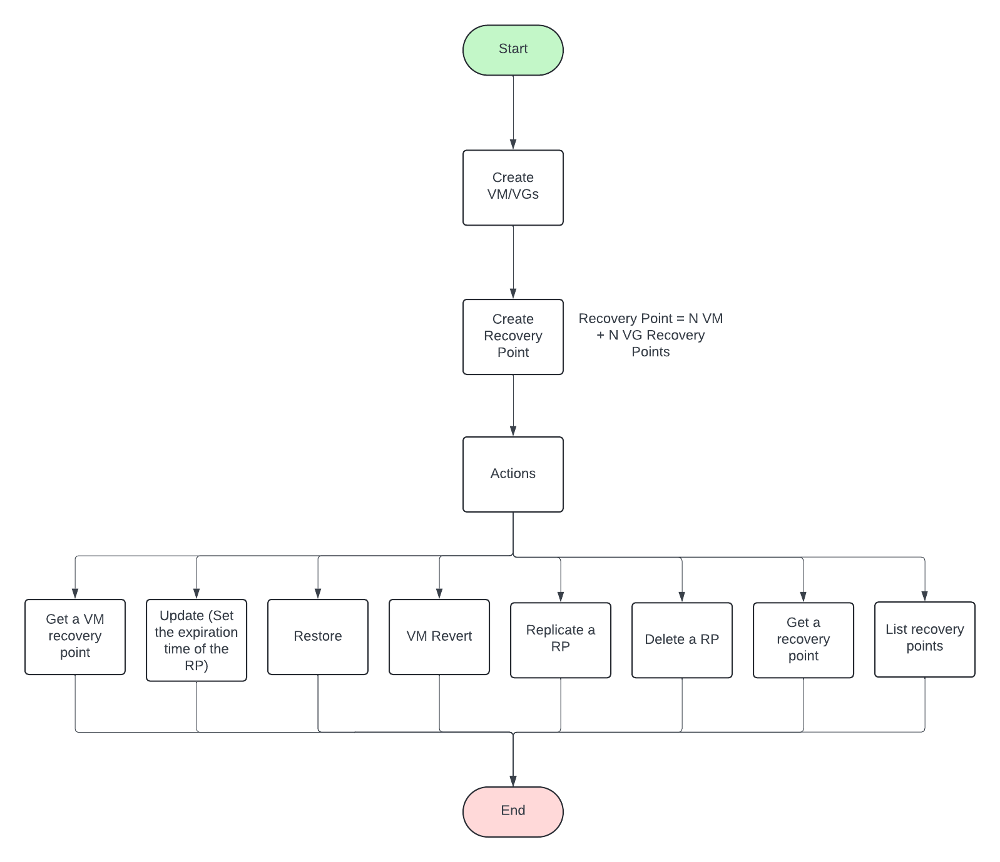

# Recovery Points under Data Protection Namespace

Recovery points are critical in ensuring data protection and disaster recovery for virtual machines (VMs) and volume groups (VGs). They allow for capturing the state of VMs and VGs at a specific point in time, enabling various operations such as restoration, replication, and reversion.

This blog provides an overview of recovery points, operations like Create, Update, Read, and Delete, and other functionalities such as restoring, replicating, and reverting recovery points. A flow diagram will be included to illustrate these concepts (to be added).


---

## Operations on Recovery Points

### 1. Create, Update, and Delete Recovery Points
The `ntnx_recovery_points_v2` module is used to manage recovery points. It supports creating, updating, and deleting recovery points for:
- A single VM
- A single VG
- Multiple VMs or VGs
- A combination of VMs and VGs

#### Example Code
`Create Recovery Point for Multiple VMs and VGs`
```
- name: Create recovery point with multiple VMs and VGs
  ntnx_recovery_points_v2:
    nutanix_host: "{{ ip }}"
    nutanix_username: "{{ username }}"
    nutanix_password: "{{ password }}"
    validate_certs: "{{ validate_certs }}"
    name: "{{ recovery_point_name }}_5"
    expiration_time: "{{ expiration_time }}"
    recovery_point_type: "CRASH_CONSISTENT"
    vm_recovery_points:
      - vm_ext_id: "3f50a1b2-4c3d-4e6a-9b8e-1a2b3c4d5e6f"
      - vm_ext_id: "7e8f9a0b-1c2d-3e4f-5a6b-7c8d9e0f1a2b"
    volume_group_recovery_points:
      - volume_group_ext_id: "9b8a7c6d-5e4f-3a2b-1c0d-9e8f7a6b5c4d"
      - volume_group_ext_id: "2d3e4f5a-6b7c-8d9e-0f1a-2b3c4d5e6f7g"
  register: result
  ignore_errors: true
```
`Update Expiration Time of Recovery Points`
```
- name: Update recovery point expiration time
  ntnx_recovery_points_v2:
    nutanix_host: "{{ ip }}"
    nutanix_username: "{{ username }}"
    nutanix_password: "{{ password }}"
    validate_certs: "{{ validate_certs }}"
    ext_id: 6j24g6z1-4f3w-0f3q-5j2j-4n1y9d2e7j3r
    expiration_time: "2024-09-30T14:15:22+00:00"
  register: result
  ignore_errors: true
```
`Delete a Recovery Point`
```
- name: Delete a recovery point
  ntnx_recovery_points_v2:
    nutanix_host: "{{ ip }}"
    nutanix_username: "{{ username }}"
    nutanix_password: "{{ password }}"
    validate_certs: "{{ validate_certs }}"
    state: absent
    ext_id: 6j24g6z1-4f3w-0f3q-5j2j-4n1y9d2e7j3r
  register: result
  ignore_errors: true
```
---

### 2. Retrieve Recovery Point Information
The `ntnx_recovery_points_info_v2` module fetches details of recovery points. This is essential for monitoring and managing existing recovery points effectively.

#### Example Code
`List all recovery points with filter`
```
- name: List all recovery points with filter
  ntnx_recovery_points_info_v2:
    nutanix_host: "{{ ip }}"
    nutanix_username: "{{ username }}"
    nutanix_password: "{{ password }}"
    validate_certs: "{{ validate_certs }}"
    filter: "name eq 'recovery_point_name'"
  register: result
  ignore_errors: true
```
`Get details of a Recovery Point`
```
- name: Get recovery point details
  ntnx_recovery_points_info_v2:
    nutanix_host: "{{ ip }}"
    nutanix_username: "{{ username }}"
    nutanix_password: "{{ password }}"
    validate_certs: "{{ validate_certs }}"
    ext_id: "6j24g6z1-4f3w-0f3q-5j2j-4n1y9d2e7j3r"
  register: result
  ignore_errors: true
```
---

## Additional Operations

### 3. Restore Recovery Points
The `ntnx_recovery_point_restore_v2` module is used to restore a recovery point. This operation creates a clone of the VMs or VGs specified in the recovery point spec. If no specific entity is provided, clones for all entities under the top-level recovery point are created.

#### Example Code
```
- name: Restore recovery point for multiple VMs and VGs
  ntnx_recovery_point_restore_v2:
    nutanix_host: "{{ ip }}"
    nutanix_username: "{{ username }}"
    nutanix_password: "{{ password }}"
    validate_certs: "{{ validate_certs }}"
    ext_id: "6j24g6z1-4f3w-0f3q-5j2j-4n1y9d2e7j3r"
    cluster_ext_id: "{{ cluster.uuid }}"
    vm_recovery_point_restore_overrides:
      - vm_recovery_point_ext_id: "1a2b3c4d-5e6f-7g8h-9i0j-1k2l3m4n5o6p"
      - vm_recovery_point_ext_id: "4d5e6f7g-8h9i-0j1k-2l3m-4n5o6p7q8r9s"
    volume_group_recovery_point_restore_overrides:
      - volume_group_recovery_point_ext_id: "7g8h9i0j-1k2l-3m4n-5o6p-7q8r9s0t1u2v"
      - volume_group_recovery_point_ext_id: "0j1k2l3m-4n5o-6p7q-8r9s-0t1u2v3w4x5y"
  register: result
  ignore_errors: true
```
---

### 4. VM Revert
The `ntnx_vm_revert_v2` module reverts a VM back to the state at which the recovery point was created. This is particularly useful for undoing changes or recovering from system failures.

#### Example Code
```
- name: Revert a VM recovery point
  ntnx_vm_revert_v2:
    nutanix_host: "{{ ip }}"
    nutanix_username: "{{ username }}"
    nutanix_password: "{{ password }}"
    validate_certs: "{{ validate_certs }}"
    ext_id: "3f50a1b2-4c3d-4e6a-9b8e-1a2b3c4d5e6f"
    vm_recovery_point_ext_id: "1a2b3c4d-5e6f-7g8h-9i0j-1k2l3m4n5o6p"
  register: result
  ignore_errors: true
```

---

### 5. Replicate Recovery Points
Replication creates a replica of a recovery point on another cluster. The `ntnx_recovery_point_replicate_v2` module requires the following setup:
1. Create an availability zone from your Prism Central to the target PC.
2. Obtain the external ID of the target PC and its cluster external ID.

#### Example Code
```
- name: Replicate Recovery point
  ntnx_recovery_point_replicate_v2:
    nutanix_host: "{{ ip }}"
    nutanix_username: "{{ username }}"
    nutanix_password: "{{ password }}"
    validate_certs: "{{ validate_certs }}"
    ext_id: "6j24g6z1-4f3w-0f3q-5j2j-4n1y9d2e7j3r"
    pc_ext_id: "{{ pc_uuid_of_target_pc }}"
    cluster_ext_id: "{{ cluster_uuid_of_target_pc }}"
  register: result
  ignore_errors: true
```

---

### 6. Retrieve VM Recovery Point Information
The `ntnx_vm_recovery_point_info_v2` module fetches detailed information about VM recovery points. This helps in auditing and verifying recovery point states.

#### Example Code
```
- name: Get a VM recovery point details
  ntnx_vm_recovery_point_info_v2:
    nutanix_host: "{{ ip }}"
    nutanix_username: "{{ username }}"
    nutanix_password: "{{ password }}"
    validate_certs: "{{ validate_certs }}"
    recovery_point_ext_id: "6j24g6z1-4f3w-0f3q-5j2j-4n1y9d2e7j3r"
    vm_recovery_point_ext_id: "4d5e6f7g-8h9i-0j1k-2l3m-4n5o6p7q8r9s"
  register: result
  ignore_errors: true
```

---

Recovery points are an integral part of data protection strategies. The operations and modules discussed above provide a robust framework for managing and leveraging recovery points efficiently.

See detailed information in [ Nutanix Recovery Point V4 ](https://developers.nutanix.com/api-reference?namespace=dataprotection&version=v4.0)
